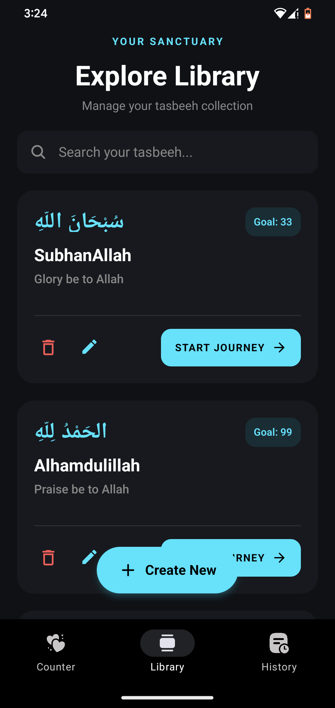
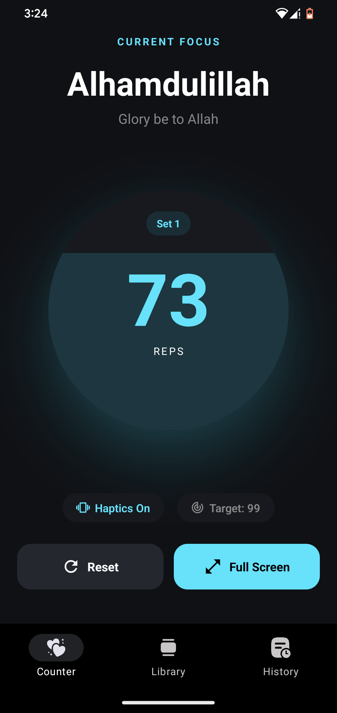
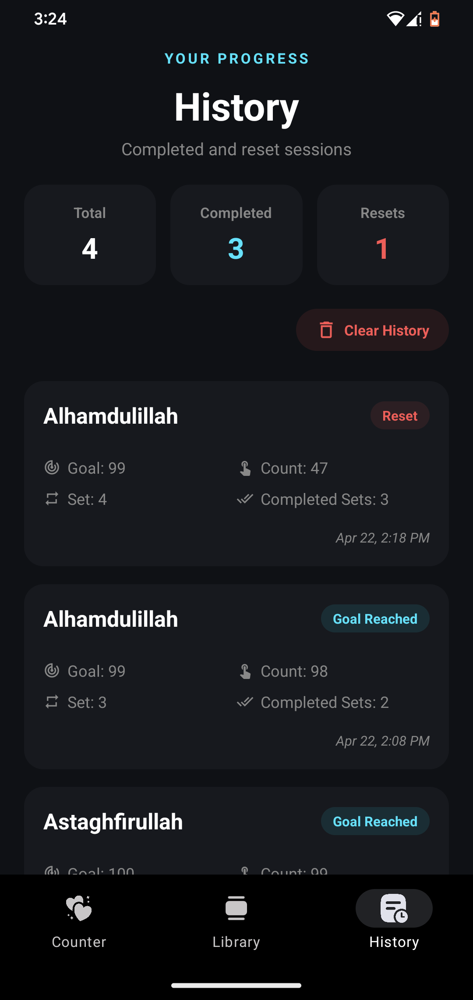

# ✨ Noorly | نورلي 

**Noorly** is a premium, modern digital Tasbeeh counter and dhikr companion built with Expo and React Native. Designed for serenity and focus, it blends elegant glassmorphism aesthetics with powerful tracking features to help you maintain your daily spiritual journey.

---

## 📱 Features

- **🏛️ Tasbeeh Library**: Manage your personal collection of dhikr. Create, edit, and categorize your prayers with custom goals (33, 99, or more).
- **🔢 Interactive Counter**: A high-performance counter featuring haptic feedback and real-time set tracking.
- **🖥️ Fullscreen Mode**: Minimize distractions with an immersive, minimal counting interface.
- **📊 Detailed History**: Track your progress over time with a session history powered by localized SQLite storage.
- **🎨 Premium UI/UX**: 
  - Dark-mode first design for eye comfort.
  - Stunning Glassmorphism effects.
  - Smooth micro-animations using React Native Reanimated.
- **📳 Haptic Experience**: Physical tactile feedback for every tap, ensuring you never miss a count.

---

## 📸 Screenshots

| Library | Global Counter | History | Immersive Mode |
| :---: | :---: | :---: | :---: |
|  |  |  |  |

---

## 🛠️ Tech Stack

- **Framework**: [Expo](https://expo.dev/) (SDK 55)
- **Language**: [TypeScript](https://www.typescriptlang.org/)
- **Navigation**: [Expo Router](https://docs.expo.dev/router/introduction/) (File-based)
- **Database**: [Expo SQLite](https://docs.expo.dev/versions/latest/sdk/sqlite/)
- **Animations**: [React Native Reanimated](https://docs.swmansion.com/react-native-reanimated/)
- **Visuals**: `expo-glass-effect`, `expo-symbols`
- **Haptics**: `expo-haptics`

---

## 🚀 Getting Started

### Prerequisites

- [Node.js](https://nodejs.org/) (LTS)
- [Bun](https://bun.sh/) (Recommended) or npm
- [Expo Go](https://expo.dev/go) on your mobile device (for testing)

### Installation

1. **Clone the repository**:
   ```bash
   git clone https://github.com/yourusername/noorly.git
   cd noorly
   ```

2. **Install dependencies**:
   ```bash
   bun install
   # or
   npm install
   ```

3. **Start the development server**:
   ```bash
   npx expo start
   ```

4. **Run on your device**:
   Scan the QR code with your Expo Go app (Android) or Camera app (iOS).

---

## 📂 Project Structure

```text
src/
├── app/              # Expo Router pages (Tabs & Modals)
├── components/       # Reusable UI components
├── context/          # State management (Tasbeeh contexts)
├── hooks/            # Custom React hooks (SQLite, Haptics)
├── constants/        # Theme & App configuration
└── utils/            # Helper functions
```

---

## 📄 License

This project is licensed under the MIT License - see the [LICENSE](LICENSE) file for details.

---

<p align="center">
  Built with ❤️ for the Ummah.
</p>
